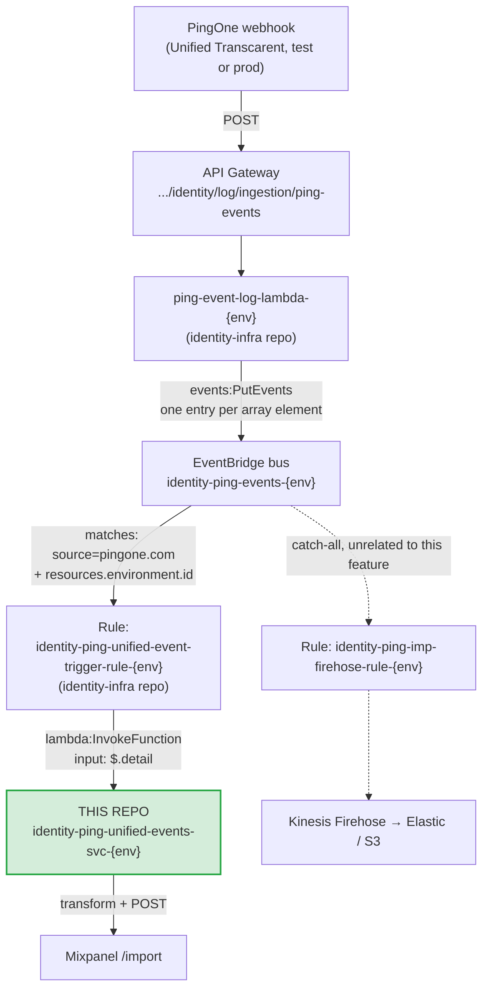

# Ping Unified Events Lambda

Lambda used to receive log events from the Ping unified environment.

## Purpose

Captures events from the PingOne "Unified" environment
(test: `9221ad0f-1c2f-4873-b6b4-9ff0b8011c82`, prod: `c4d8d0fc-156e-4938-8671-b725f085d585`)
and processes them for downstream consumption. Today it transforms and
forwards user-access (SSO) events to a Mixpanel funnel, but the same
capture-and-process pattern can serve future consumers as well.

Deploys independently to both `test` and `prod` via the Jenkins pipeline
(see `Jenkinsfile` / delivery model below); the two environments are
otherwise identical in code, differing only by the Ping environment ID the
upstream EventBridge rule filters on.

## Data flow

This Lambda is the last hop in a shared pipeline, deployed identically to
`test` and `prod` (differing only in the Ping environment ID the rule
filters on). Everything upstream of the EventBridge rule is owned by the
separate `identity-infra` CDK repo, not this one.



### Why the flow looks like this

- **PingOne always sends a JSON array**, even for a single event. `ping-event-log-lambda`
  (upstream, not owned by this repo) unwraps that array and publishes each
  element to EventBridge individually as `detail`, unmodified — this Lambda
  receives the raw Ping activity object shape as-is, not re-wrapped.
- **EventBridge, not a direct webhook, is the trigger** — this Lambda is
  never called directly by PingOne or API Gateway. It's invoked only when
  the EventBridge rule's pattern matches.
- **This Lambda and its EventBridge rule are the only two things this repo
  is responsible for.** The webhook, API Gateway, unwrap-Lambda, and
  EventBridge bus itself all live in the `identity-infra` repo and are shared
  with unrelated event types (workforce terminations, group membership
  changes) — changes to those are out of scope here.

The pre-existing Firehose catch-all rule (dotted path above) continues to
receive matching events independently; this Lambda's rule is additive, not a
redirect.

## Mixpanel

The Lambda filters for `USER.ACCESS_ALLOWED`/`USER.ACCESS_DENIED`, transforms the event
into a Mixpanel event body, and POSTs it to `https://api.mixpanel.com/import?strict=1`
(auth: project token as the basic-auth username, empty password).
Routing is by **Ping environment id** (see `src/config.ts`):

| Ping environment id | Env name | Mixpanel project | SSM token parameter |
|---|---|---|---|
| `9221ad0f-…-9ff0b8011c82` | Non-Prod Unified | test | `/identity/ping-unified-events/mixpanel-token-nonprod` |
| `c4d8d0fc-…-b725f085d585` | Prod Unified | prod | `/identity/ping-unified-events/mixpanel-token-prod` |

Events from any other environment are ignored.

### SSM parameters (create out of band, per account)

The Mixpanel project token is **not** in the repo. Create it as a **SecureString**
parameter using the AWS-managed `alias/aws/ssm` key in each account:

```sh
aws ssm put-parameter \
  --name /identity/ping-unified-events/mixpanel-token-nonprod \
  --type SecureString \
  --value <mixpanel-project-token>
```

The Lambda's IAM policy (see `template.yml`) grants `ssm:GetParameter` on
`/identity/ping-unified-events/*`.

## Open items / TODO

1. Narrow the EventBridge rule to `USER.ACCESS_ALLOWED`/`USER.ACCESS_DENIED` only — the
   rule currently catches all events for this Ping environment, unfiltered by
   `action.type`.
2. Create the **prod** SSM token parameter and confirm prod routing once the
   prod Mixpanel key is available.
3. Confirm a correlation key — need a field on the real access event that
   ties back to Okta's AuthnRequest ID (`InResponseTo`). Candidates:
   `correlationId`, `internalCorrelation.sessionId`. Needed to stitch the
   full login funnel per attempt.
