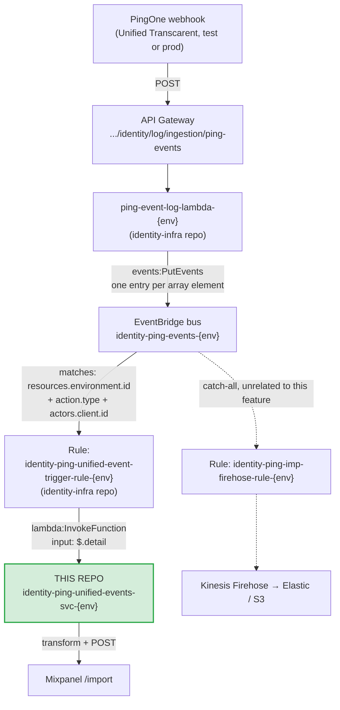

# Ping Unified Events Lambda

Lambda used to receive log events from the Ping unified environment.

## Purpose

Captures events from the PingOne "Unified" environment
(test: `9221ad0f-1c2f-4873-b6b4-9ff0b8011c82`, prod: `c4d8d0fc-156e-4938-8671-b725f085d585`)
and processes them for downstream consumption. Currently it transforms and
forwards (SSO) events from the Okta unified proxy SSO to Mixpanel, but the same
capture-and-process pattern can serve future consumers as well.

Deploys independently to both `test` and `prod` via the Jenkins pipeline. 

## Data flow

This Lambda is the last step in a shared pipeline, everything upstream of the EventBridge rule is in the `identity-infra` CDK repo, not this one.



### What the EventBridge rule actually filters

The rule (`createPingUnifiedLogsRule` in `identity-infra`) is **not** a catch-all. It matches
on three things, all ANDed:

- `detail.resources.environment.id` — the unified env id for the stage.
- `detail.action.type` — an explicit list (see the warning below).
- `detail.actors.client.id` — the configured `unifiedTranscarentApplicationIds`, applied only
  when that list is non-empty.

The `source` pattern is `[{ prefix: '' }]`, i.e. **match any source** — not `pingone.com` as
previously documented here.

Two consequences worth holding onto: the rule's app-id list is the **outer** gate on what this
Lambda can ever see, and it is maintained in a different repo from `config.ts`. An app absent
from the rule can never reach direction resolution no matter what `config.ts` says, and an app
present in the rule but absent from `config.ts` lands in Mixpanel as `unknown_direction`.

> ### 🚨 `FLOW.CREATED` is filtered out by the rule
>
> `TRACKED_EVENT_TYPES` includes `FLOW.CREATED`, but the rule's `unifiedActionTypes` list does
> **not**. It lists `FLOW.COMPLETED`, `FLOW.DELETED`, `FLOW.STARTED`, `FLOW.UPDATED`.
>
> **`FLOW.STARTED` and `FLOW.COMPLETED` are not real PingOne action types.** Verified against
> the [PingOne audit event reference][ping-events]: the only three that exist are
> `FLOW.CREATED`, `FLOW.UPDATED`, `FLOW.DELETED`. The two bogus names are the audit UI's
> *display labels* ("Sign-on flow started", "Flow Completed") uppercased into wire format —
> a plausible-looking mistake that fails silently, because an EventBridge pattern listing a
> value that never occurs simply never matches. No error, no warning.
>
> So the rule filters on two entries that can never match and drops the one the funnel depends
> on.
>
> [ping-events]: https://developer.pingidentity.com/pingone-api/platform/reference/audit-reporting-events.html
>
> `FLOW.CREATED` is the only signal that an attempt reached Ping at all, and the only way to
> see a user abandoning on Ping's login page — Okta logs nothing while it waits. Losing it
> silently removes the first step of the outbound funnel and makes abandonment unmeasurable.
>
> This is a **regression**: `FLOW.CREATED` was confirmed arriving live on 2026-08-09 (see
> Resolved), before the EventBridge rule was introduced. **Fix in `identity-infra`** —
> `unifiedActionTypes` becomes:
>
> ```diff
> - "FLOW.COMPLETED",
>    "FLOW.DELETED",
> - "FLOW.STARTED",
> + "FLOW.CREATED",
>    "FLOW.UPDATED",
> ```
>
> No change is needed in this repo — `TRACKED_EVENT_TYPES` is correct as written, and all four
> of its entries are verified real action types.

`FLOW.UPDATED`, `SESSION.CREATED`, `SESSION.UPDATED` and `FLOW_EXECUTION.CREATED`/`.UPDATED`
are admitted by the rule but dropped by `isTrackedEvent()`, so they cost an invocation each
and produce nothing. All are real action types (unlike the two above), but `FLOW_EXECUTION.*`
has never been observed firing for these apps.

`SESSION.DELETED` is also a real type and is subscribed nowhere — the natural logout signal
if that ever becomes interesting.

### Why the flow looks like this

- **PingOne always sends a JSON array**, even for a single event. `ping-event-log-lambda`
   unwraps the array and publishes each
  event to EventBridge individually.
- **EventBridge is the trigger** — this is
  never called directly by PingOne or API Gateway. It's invoked when
  the EventBridge rule matches.
- **This Lambda and its EventBridge rule are the only two things this repo
  is responsible for.

The pre-existing Firehose catch-all rule (dotted path above) continues to
receive matching events independently; this Lambda's rule is additive, not a
redirect.

## Mixpanel

The Lambda filters for the tracked action types (`src/transform.ts` →
`TRACKED_EVENT_TYPES`), transforms the event into a Mixpanel event body, and POSTs it to
`https://api.mixpanel.com/import?strict=1`. Routing is by **Ping environment id**.

### Tracked events

| `action.type` | Audit-log wording | Why |
|---|---|---|
| `FLOW.CREATED` | "Sign-on flow started" | The **only** signal that an outbound attempt reached Ping. Okta logs nothing between sending its AuthnRequest and getting a response, so a user who abandons on Ping's login page leaves zero trace on the Okta side. |
| `FLOW.DELETED` | "Sign-on flow finished" | How the flow ended — `result.status` / `result.description`. |
| `USER.ACCESS_ALLOWED` | "User Access Allowed" | The app was actually reached. Also the only event when a user arrives on an existing Ping session with no sign-on flow at all. |
| `USER.ACCESS_DENIED` | "User Access Denied" | Live — observed with `result.status FAILED`, "Failed role access control". |

**Not tracked:** `FLOW.UPDATED` ("Sign-on flow continued") duplicates `FLOW.DELETED` in the
same second with an identical description, and a multi-step flow emits several of them, so
its count isn't stable per flow. Session Created/Updated pass the EventBridge rule but are
ignored here.

> ⚠️ `FLOW.CREATED` is tracked by this Lambda but **currently never reaches it** — the
> EventBridge rule filters it out. See [the rule warning](#what-the-eventbridge-rule-actually-filters).

### Mixpanel identity

`distinct_id` is **`sso_uuid`** — the identity shared with the Okta lambda's events, and the
only field enriched into both systems, so it is what joins them into one funnel.
`correlation_id`, `transaction_id` and `flow_id` are kept as properties.

Three things follow, all confirmed against real payloads:

- **A bare failure sentinel must never be the `distinct_id`.** `resolveDistinctId()` appends
  the value that was searched on. Without that, every unresolved event across every user
  collapses into one Mixpanel profile and shows phantom conversions between unrelated people.
- **`FLOW.CREATED` carries no `actors.user`** — confirmed in both raw payloads and audit
  exports, where "Sign-on flow started" rows have an empty user identity. Its `distinct_id`
  therefore falls back to the flow's transaction id, so **it cannot be step 1 of a funnel with
  the user-keyed events** — such a funnel reads 0% conversion. Measure abandonment as
  `count(FLOW.CREATED) − count(FLOW.DELETED)`.
- **`correlationId` is per-event, not per-flow.** Two events from the same flow carry
  different `correlationId`s while sharing `internalCorrelation.transactionId` and the `FLOW`
  resource id. Constrain funnel steps on `transaction_id` (or `flow_id`), never
  `correlation_id`.

### Direction

Events are named `PING.<direction>.<action.type>`. Direction comes from matching
`actors.client.id` against `outboundApps`/`inboundApps` in `config.ts`; an unmatched app
yields `unknown_direction` (a single token, so the event name has no spaces).

Unlike the Okta lambda, there is **no kind-based fallback here** — an app that isn't in one
of the two lists is `unknown_direction`, full stop. Direction labeling on this side is
therefore entirely dependent on the config lists being right.

> **Mobile is deliberately absent from `inboundApps`.** The Android and iOS app ids were
> previously listed in both `test3` and `prod`, but mobile apps don't participate in inbound
> SSO — only Web does. Any event they produced was labeled `inbound` on an app that has no
> inbound flow. They are excluded in both environments; do not re-add them.
>
> **The mobile ids are still in the EventBridge rule's app filter** (`identity-infra` →
> `unifiedTranscarentApplicationIds`, both test and prod), so mobile events still reach this
> Lambda — they now emit as `PING.unknown_direction.USER.ACCESS_*` instead of a false
> `inbound`. That is the correct trade (honest noise beats confident mislabeling), but the
> cleaner fix is to also drop mobile from the rule so the events never arrive. That is a
> product call, not a mechanical one: mobile `USER.ACCESS_ALLOWED` is real portal access, just
> not *inbound SSO*. Decide whether it should be dropped at the rule, or kept and given its
> own direction value rather than `unknown_direction`.

| Env | List | Id | App |
|---|---|---|---|
| test3 | `outboundApps` | `71d1203c-…` | Nonprod - Unified Transcarent - Outbound SSO Proxy |
| test3 | `outboundApps` | `5666a895-…` | TC Okta Outbound SSO (Ping→Okta outbound federation app) |
| test3 | `inboundApps` | `60e1487c-…` | TC Okta — Ping external IdP, the Okta→Ping inbound federation object |
| test3 | `inboundApps` | `5566e1f4-…` | Unified Transcarent Web App — confirmed inbound-landing app |
| prod | `outboundApps` | `c695c059-…` | TC Okta Outbound SSO — asserts into the Okta `outboundIDPs` anchor |
| prod | `inboundApps` | `e9e0e9e0-…` | TC Okta — inbound SAML IdP trusting prod-tc Okta |
| prod | `inboundApps` | `7f71ab98-…` | Unified Transcarent Web App |

> **The two "TC Okta" external-IdP entries are inert.** `60e1487c-…` and `e9e0e9e0-…` are in
> `inboundApps`, but `resolveDirection()` only matches `actors.client.id`, and neither id
> appears in the EventBridge rule's app filter — so no event that reaches this Lambda can
> carry them as its client. They can never match. **Inbound direction rests entirely on the
> Web app id** (`5566e1f4-…` / `7f71ab98-…`).
>
> That makes the Web app a discriminator with the same weakness as `Single_Factor` below: it
> works only while every `USER.ACCESS_*` on the Web app comes from inbound SSO. An ordinary
> portal session on the same app would be labeled `inbound` too. Confirm against a real
> capture, and consider whether the IdP entries should be removed as dead config or whether
> direction should key on something else.

> #### ⚠️ `Single_Factor` is a temporary discriminator
>
> Inbound federated SSO runs through Ping's **`Single_Factor`** policy, not
> `Inbound-Federation-SSO` (which real audit logs show getting zero hits). The policy name
> arrives in `action_description`, e.g. `"Sign-on flow started with policies [Single_Factor]"`.
>
> **Today `Single_Factor` is used only for federated SSO, so filtering on it works and is fine
> for shipping.** But it is the default policy — as soon as it also serves anything else (a
> plain password login to the same app), it stops isolating federated SSO and **a new
> discriminator is required**. Accepted deliberately: this is a temp service that needs to be
> up quickly.

### Secrets (AWS Secrets Manager)

Secret values: the Mixpanel project token (`mixpanelToken`) and the PingOne
 client secret (`pingClientSecret`) live in a single JSON secret **per environment**, in `us-east-1`, **shared with the Okta unified-migration lambda**:


```sh
aws secretsmanager get-secret-value \
  --region us-east-1 \
  --secret-id /identity/lambda/unified-migration-event-svc/test \
  --query SecretString --output text
```

The Lambda's IAM policy (see `template.yml`) grants `secretsmanager:GetSecretValue`
on `/identity/lambda/unified-migration-event-svc/*`.

**The merged env is cached per Ping environment id for the container's lifetime, with no
TTL** — secret values aren't expected to change while this logging is in use, so there is
nothing to rotate into. That makes a *partial* secret more dangerous than a missing one: a
missing secret throws and retries, but caching an absent field would break every invocation
on that warm container with no further Secrets Manager call, until it happened to cold-start.
`loadPingEnv()` therefore **validates `mixpanelToken` and `pingClientSecret` before assigning
the cache and throws naming the missing ones**. Nothing is cached on failure, so the next
invocation refetches and a fix to the secret is picked up immediately rather than waiting for
a cold start.

### PingOne token cache (SSM Parameter Store)

To look up the user's `ssoUUID`, the Lambda needs a PingOne `client_credentials`
access token. That token has a real TTL, so instead of
fetching one per event, `fetchPingToken` (`src/util.ts`) caches it in two layers:

- **warm-container memory:** a module-scope map, reused for the life of the
  execution environment.
- **SSM Parameter Store (SecureString):** shared across all concurrent
  containers, so a token fetched by one is reused by the others. One parameter
  per Ping environment id:

```sh
aws ssm get-parameter \
  --region us-east-1 \
  --name /identity/lambda/ping-unified-events-svc/ping-token/<pingEnvId> \
  --with-decryption --query Parameter.Value --output text
```

On a miss/near-expiry a single caller gets a new token from PingOne and
writes it to Parameter Store. PingOne token calls drop from one-per-event to
roughly one per TTL window.

The parameter is **created on first write** (`PutParameter`, `Overwrite=true`) —
nothing to pre-provision. The IAM policy grants `ssm:GetParameter`/`ssm:PutParameter`
on `/identity/lambda/ping-unified-events-svc/ping-token/*`, and the value is
encrypted with the default `alias/aws/ssm` key.

## Open items / TODO

1. **🚨 Restore `FLOW.CREATED` to the EventBridge rule** (`identity-infra`). The rule drops it
   and admits two action types that don't exist. Highest-impact item here — it silently
   removes the first funnel step. Full detail under [Data flow](#what-the-eventbridge-rule-actually-filters).
2. **Map "External Partner Test" (`47452c03-3e72-4cca-8c2e-ee39fe7c4d63`).** It is in the
   **test** rule's app filter but has no `config.ts` entry, so its events emit as
   `PING.unknown_direction.*`. Likely the inbound origination app, but that's a guess — confirm
   the direction before adding it rather than assuming. There is no prod equivalent in the
   rule. (The older note about a 7th unmapped "Unified Transcarent" app is superseded: the
   rule's test list has exactly six ids, all accounted for.)
3. **Decide what mobile should do.** Android/iOS are out of `inboundApps` but still in the
   rule's app filter, so they arrive and emit `unknown_direction` — see Direction.
4. **The two "TC Okta" IdP ids in `inboundApps` are provably dead config** — they aren't in
   the rule's app filter, so they can never match `actors.client.id`. Remove them, or change
   what inbound keys on. See Direction.
5. **Trim the rule's action types.** `FLOW.UPDATED`, `SESSION.*` and `FLOW_EXECUTION.*` are
   forwarded and then dropped by `isTrackedEvent()`, costing an invocation each.
   `FLOW_EXECUTION.*` has never fired and can go outright.
6. **~~Map the prod outbound SSO proxy app~~ — likely a non-issue.** `config.ts` prod
   `outboundApps` has only "TC Okta Outbound SSO" (`c695c059-…`), and the EventBridge rule's
   prod app list has no proxy app either — the two agree, and the test-only "Nonprod - Unified
   Transcarent - Outbound SSO Proxy" appears to be a nonprod-only construct. Close this once
   someone confirms prod genuinely has no proxy app rather than one nobody has wired up.
7. **No DLQ or failure destination.** A Mixpanel failure rethrows from the handler
   (`src/index.ts`), EventBridge retries, and the event is then dropped with no record.
   Accepted for now — deliberately deferred, not blocked. Adding a DLQ (or an
   `EventInvokeConfig` failure destination) plus an alarm on its depth is the fix.
8. **Nothing publishes custom metrics.** `template.yml` grants
   `cloudwatch:PutMetricData` on `${SystemName}/custom_metrics` but no code uses it, so
   there is no signal to alarm on beyond Lambda's built-in `Errors`/`Throttles`.

### Prod prerequisites (status)

- **Secrets** — `/identity/lambda/unified-migration-event-svc/prod` (account `063473290800`)
  holds the prod `mixpanelToken` and `pingClientSecret`. ✅ Done.
- **EventBridge** — bus `identity-ping-events-prod` and rule
  `identity-ping-unified-event-trigger-rule-prod` are defined in `identity-infra`
  (`lib/config.ts`, `lib/identityEventBusRulesStack.ts`) and match the ARN hardcoded in
  this repo's `ConfigLambdaPermission`. ✅ Done.
- **Ping client role** — the prod Logging Client (`6f4c12cf-…`) needs a role granting user
  read on the prod env, or `fetchPingUser` returns a sentinel and every prod event gets a
  sentinel `distinct_id`. Verify.
- **`ssoUUID` populated on prod Ping users** — same failure mode. Verify.
- **Webhook endpoint URL** — the prod and nonprod webhooks in
  `terraform-tc/pingidentity/*/pingone/webhooks/log-ingestion/terragrunt.hcl` share one
  hardcoded API Gateway host (`8a5tesyg70`), which is not the test gateway
  (`ed1cm24iu0`). One of the two is pointed at the wrong environment. Owned by
  `terraform-tc`, not this repo. Its `x-api-key` is also a console-set placeholder in
  Terraform, so prod needs the real key set manually.

### Resolved

All of the below were settled from CloudWatch on 2026-08-09 with the new code deployed.

- ~~Confirm the real `action.type` strings.~~ The webhook UI's "Flow Completed" **is**
  `FLOW.DELETED` — there is no `FLOW.COMPLETED`, so `TRACKED_EVENT_TYPES` is correct as
  written. Session events are `SESSION.CREATED`/`SESSION.UPDATED` (received, ignored).
  **No `FLOW_EXECUTION.*` event ever fired**, so the Flow vs Flow Execution ambiguity is
  moot for these apps.
- ~~Does `transactionId` span `FLOW.CREATED` → `FLOW.DELETED`?~~ **Yes** — both carried
  `8fac0627-8122-475f-9f8f-094aa6155c10`. Abandonment can be grouped by `transaction_id`.
  Note `USER.ACCESS_ALLOWED` has its **own** transaction id, so ACCESS events join to a flow
  only via `sso_uuid` + time window, not `transaction_id`.
- ~~Is `ssoUUID` top-level on the PingOne user object?~~ **Yes.** `json?.ssoUUID` is the
  correct path; it returns e.g. `ssopt|ed091ca6-c2c8-4b46-ae16-cee50b500b14`.
- ~~Unify the SSO identifier property + `distinct_id`.~~ Done — this lambda now emits
  `sso_uuid` and keys `distinct_id` on it, matching the Okta lambda. Verified live:
  `FLOW.DELETED` and `USER.ACCESS_ALLOWED` both carry the real `sso_uuid`, and
  `FLOW.CREATED` correctly falls back to `unable to find ping user:<transactionId>` because
  it has no user.
- ~~Confirm a correlation key back to Okta's AuthnRequest ID.~~ Answered, negatively:
  Ping's `correlationId` and Okta's `authnRequestId` were confirmed **not** to match, and
  `correlationId` is per-event rather than per-flow. There is **no shared session/flow key**
  between the two systems. `sso_uuid` is the only cross-system join, so cross-system step
  correlation is user + time window only. Within Ping, group on `transaction_id`/`flow_id`;
  within Okta, on `okta_session_id`/`okta_transaction_id`.
