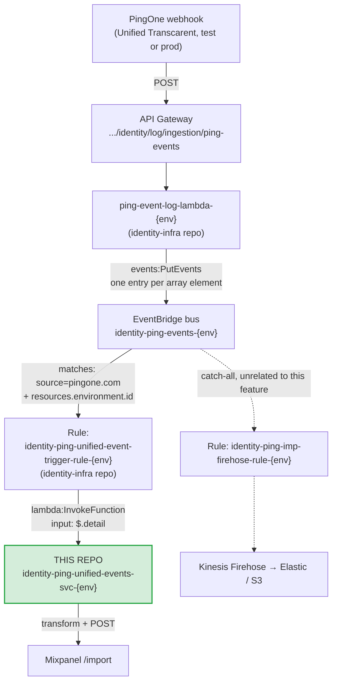

# Ping Unified Events Lambda

Lambda used to receive log events from the Ping unified environment.

## Purpose

Captures events from the PingOne "Unified" environment
(test: `9221ad0f-1c2f-4873-b6b4-9ff0b8011c82`, prod: `c4d8d0fc-156e-4938-8671-b725f085d585`)
and processes them for downstream consumption. Currently it transforms and
forwards (SSO) events from the Okta unified proxy SSO to Mixpanel, but the same
capture-and-process pattern can serve future consumers as well.

Deploys independently to both `test` and `prod` via the Jenkins pipeline. 

## Data flow

This Lambda is the last step in a shared pipeline, everything upstream of the EventBridge rule is in the `identity-infra` CDK repo, not this one.



### Why the flow looks like this

- **PingOne always sends a JSON array**, even for a single event. `ping-event-log-lambda`
   unwraps the array and publishes each
  event to EventBridge individually.
- **EventBridge is the trigger** — this is
  never called directly by PingOne or API Gateway. It's invoked when
  the EventBridge rule matches.
- **This Lambda and its EventBridge rule are the only two things this repo
  is responsible for.

The pre-existing Firehose catch-all rule (dotted path above) continues to
receive matching events independently; this Lambda's rule is additive, not a
redirect.

## Mixpanel

The Lambda filters for `USER.ACCESS_ALLOWED`/`USER.ACCESS_DENIED`, transforms the event
into a Mixpanel event body, and POSTs it to `https://api.mixpanel.com/import?strict=1`
Routing is by **Ping environment id**:

### Secrets (AWS Secrets Manager)

Secret values: the Mixpanel project token (`mixpanelToken`) and the PingOne
 client secret (`pingClientSecret`) live in a single JSON secret **per environment**, in `us-east-1`, **shared with the Okta unified-migration lambda**:


```sh
aws secretsmanager get-secret-value \
  --region us-east-1 \
  --secret-id /identity/lambda/unified-migration-event-svc/test \
  --query SecretString --output text
```

The Lambda's IAM policy (see `template.yml`) grants `secretsmanager:GetSecretValue`
on `/identity/lambda/unified-migration-event-svc/*`.

### PingOne token cache (SSM Parameter Store)

To look up the user's `ssoUUID`, the Lambda needs a PingOne `client_credentials`
access token. That token has a real TTL, so instead of
fetching one per event, `fetchPingToken` (`src/util.ts`) caches it in two layers:

- **warm-container memory:** a module-scope map, reused for the life of the
  execution environment.
- **SSM Parameter Store (SecureString):** shared across all concurrent
  containers, so a token fetched by one is reused by the others. One parameter
  per Ping environment id:

```sh
aws ssm get-parameter \
  --region us-east-1 \
  --name /identity/lambda/ping-unified-events-svc/ping-token/<pingEnvId> \
  --with-decryption --query Parameter.Value --output text
```

On a miss/near-expiry a single caller gets a new token from PingOne and
writes it to Parameter Store. PingOne token calls drop from one-per-event to
roughly one per TTL window.

The parameter is **created on first write** (`PutParameter`, `Overwrite=true`) —
nothing to pre-provision. The IAM policy grants `ssm:GetParameter`/`ssm:PutParameter`
on `/identity/lambda/ping-unified-events-svc/ping-token/*`, and the value is
encrypted with the default `alias/aws/ssm` key.

## Open items / TODO

1. Narrow the EventBridge rule to `USER.ACCESS_ALLOWED`/`USER.ACCESS_DENIED` only — the
   rule currently catches all events for this Ping environment, unfiltered by
   `action.type`.
2. Ensure the **prod** Secrets Manager secret
   (`/identity/lambda/unified-migration-event-svc/prod`, account `063473290800`)
   exists and confirm prod routing once the prod Mixpanel key is available.
3. Confirm a correlation key — need a field on the real access event that
   ties back to Okta's AuthnRequest ID (`InResponseTo`). Candidates:
   `correlationId`, `internalCorrelation.sessionId`. Needed to stitch the
   full login funnel per attempt.
