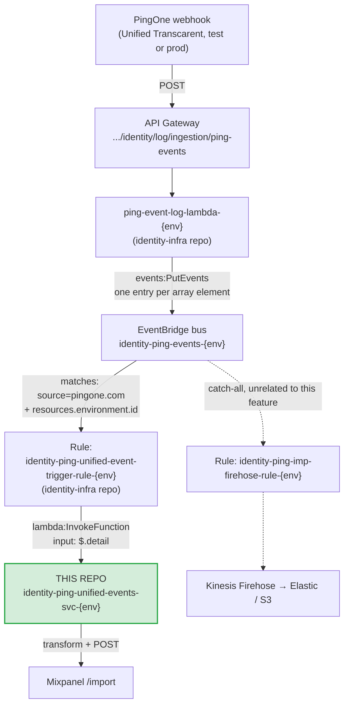

# Ping Unified Events Lambda

Lambda used to receive log events from the Ping unified environment.

## Purpose

Captures events from the PingOne "Unified" environment
(test: `9221ad0f-1c2f-4873-b6b4-9ff0b8011c82`, prod: `c4d8d0fc-156e-4938-8671-b725f085d585`)
and processes them for downstream consumption. Currently it transforms and
forwards (SSO) events from the Okta unified proxy SSO to Mixpanel, but the same
capture-and-process pattern can serve future consumers as well.

Deploys independently to both `test` and `prod` via the Jenkins pipeline. 

## Data flow

This Lambda is the last step in a shared pipeline, everything upstream of the EventBridge rule is in the `identity-infra` CDK repo, not this one.



### Why the flow looks like this

- **PingOne always sends a JSON array**, even for a single event. `ping-event-log-lambda`
   unwraps the array and publishes each
  event to EventBridge individually.
- **EventBridge is the trigger** — this is
  never called directly by PingOne or API Gateway. It's invoked when
  the EventBridge rule matches.
- **This Lambda and its EventBridge rule are the only two things this repo
  is responsible for.

The pre-existing Firehose catch-all rule (dotted path above) continues to
receive matching events independently; this Lambda's rule is additive, not a
redirect.

## Mixpanel

The Lambda filters for the tracked action types (`src/transform.ts` →
`TRACKED_EVENT_TYPES`), transforms the event into a Mixpanel event body, and POSTs it to
`https://api.mixpanel.com/import?strict=1`. Routing is by **Ping environment id**.

### Tracked events

| `action.type` | Audit-log wording | Why |
|---|---|---|
| `FLOW.CREATED` | "Sign-on flow started" | The **only** signal that an outbound attempt reached Ping. Okta logs nothing between sending its AuthnRequest and getting a response, so a user who abandons on Ping's login page leaves zero trace on the Okta side. |
| `FLOW.DELETED` | "Sign-on flow finished" | How the flow ended — `result.status` / `result.description`. |
| `USER.ACCESS_ALLOWED` | "User Access Allowed" | The app was actually reached. Also the only event when a user arrives on an existing Ping session with no sign-on flow at all. |
| `USER.ACCESS_DENIED` | "User Access Denied" | Live — observed with `result.status FAILED`, "Failed role access control". |

**Not tracked:** `FLOW.UPDATED` ("Sign-on flow continued") duplicates `FLOW.DELETED` in the
same second with an identical description, and a multi-step flow emits several of them, so
its count isn't stable per flow. Session Created/Updated are subscribed on the webhook but
ignored here.

### Mixpanel identity

`distinct_id` is **`sso_uuid`** — the identity shared with the Okta lambda's events, and the
only field enriched into both systems, so it is what joins them into one funnel.
`correlation_id`, `transaction_id` and `flow_id` are kept as properties.

Three things follow, all confirmed against real payloads:

- **A bare failure sentinel must never be the `distinct_id`.** `resolveDistinctId()` appends
  the value that was searched on. Without that, every unresolved event across every user
  collapses into one Mixpanel profile and shows phantom conversions between unrelated people.
- **`FLOW.CREATED` carries no `actors.user`** — confirmed in both raw payloads and audit
  exports, where "Sign-on flow started" rows have an empty user identity. Its `distinct_id`
  therefore falls back to the flow's transaction id, so **it cannot be step 1 of a funnel with
  the user-keyed events** — such a funnel reads 0% conversion. Measure abandonment as
  `count(FLOW.CREATED) − count(FLOW.DELETED)`.
- **`correlationId` is per-event, not per-flow.** Two events from the same flow carry
  different `correlationId`s while sharing `internalCorrelation.transactionId` and the `FLOW`
  resource id. Constrain funnel steps on `transaction_id` (or `flow_id`), never
  `correlation_id`.

### Direction

Events are named `PING.<direction>.<action.type>`. Direction comes from matching
`actors.client.id` against `outboundApps`/`inboundApps` in `config.ts`; an unmatched app
yields `unknown_direction` (a single token, so the event name has no spaces).

> #### ⚠️ `Single_Factor` is a temporary discriminator
>
> Inbound federated SSO runs through Ping's **`Single_Factor`** policy, not
> `Inbound-Federation-SSO` (which real audit logs show getting zero hits). The policy name
> arrives in `action_description`, e.g. `"Sign-on flow started with policies [Single_Factor]"`.
>
> **Today `Single_Factor` is used only for federated SSO, so filtering on it works and is fine
> for shipping.** But it is the default policy — as soon as it also serves anything else (a
> plain password login to the same app), it stops isolating federated SSO and **a new
> discriminator is required**. Accepted deliberately: this is a temp service that needs to be
> up quickly.

### Secrets (AWS Secrets Manager)

Secret values: the Mixpanel project token (`mixpanelToken`) and the PingOne
 client secret (`pingClientSecret`) live in a single JSON secret **per environment**, in `us-east-1`, **shared with the Okta unified-migration lambda**:


```sh
aws secretsmanager get-secret-value \
  --region us-east-1 \
  --secret-id /identity/lambda/unified-migration-event-svc/test \
  --query SecretString --output text
```

The Lambda's IAM policy (see `template.yml`) grants `secretsmanager:GetSecretValue`
on `/identity/lambda/unified-migration-event-svc/*`.

### PingOne token cache (SSM Parameter Store)

To look up the user's `ssoUUID`, the Lambda needs a PingOne `client_credentials`
access token. That token has a real TTL, so instead of
fetching one per event, `fetchPingToken` (`src/util.ts`) caches it in two layers:

- **warm-container memory:** a module-scope map, reused for the life of the
  execution environment.
- **SSM Parameter Store (SecureString):** shared across all concurrent
  containers, so a token fetched by one is reused by the others. One parameter
  per Ping environment id:

```sh
aws ssm get-parameter \
  --region us-east-1 \
  --name /identity/lambda/ping-unified-events-svc/ping-token/<pingEnvId> \
  --with-decryption --query Parameter.Value --output text
```

On a miss/near-expiry a single caller gets a new token from PingOne and
writes it to Parameter Store. PingOne token calls drop from one-per-event to
roughly one per TTL window.

The parameter is **created on first write** (`PutParameter`, `Overwrite=true`) —
nothing to pre-provision. The IAM policy grants `ssm:GetParameter`/`ssm:PutParameter`
on `/identity/lambda/ping-unified-events-svc/ping-token/*`, and the value is
encrypted with the default `alias/aws/ssm` key.

## Open items / TODO

1. **Confirm the real `action.type` strings from CloudWatch.** The webhook UI lists Flow
   Events as "Flow Started / Flow Updated / **Flow Completed**", but a real payload carried
   `FLOW.DELETED` with description "Sign-on flow finished". If "Flow Completed" is actually a
   separate `FLOW.COMPLETED` type, **`TRACKED_EVENT_TYPES` misses every flow-finished event
   and abandonment reads as 100%**. The webhook is also subscribed to *Flow Execution Events*,
   which the PingOne docs don't clearly distinguish from Flow Events.
   `index.ts` already logs `Ignoring other event type: <action.type>` for every untracked
   delivery — one real login, then grep that lambda's CloudWatch group, enumerates exactly
   what arrives and settles both questions. Do this before trusting any funnel numbers.
2. **Map the two unlisted webhook applications.** The "Track Proxy SSO" webhook is scoped to
   7 apps; `config.ts` maps 6 ids. **"Unified Transcarent"** and **"External Partner Test"**
   have no entry, so their events emit as `PING.unknown_direction.*`. "External Partner Test"
   is likely the inbound origination app. Add both ids with a direction.
3. **Narrow the EventBridge rule.** It still catches all events for this Ping environment,
   unfiltered by `action.type` — the in-Lambda `isTrackedEvent()` gate is the only filter, so
   every ignored event still costs an invocation. Now that Flow and Session events are
   subscribed, that volume is much higher than when this was written.
4. Ensure the **prod** Secrets Manager secret
   (`/identity/lambda/unified-migration-event-svc/prod`, account `063473290800`)
   exists and confirm prod routing once the prod Mixpanel key is available.

### Resolved

- ~~Unify the SSO identifier property + `distinct_id`.~~ Done — this lambda now emits
  `sso_uuid` and keys `distinct_id` on it, matching the Okta lambda.
- ~~Confirm a correlation key back to Okta's AuthnRequest ID.~~ Answered, negatively:
  Ping's `correlationId` and Okta's `authnRequestId` were confirmed **not** to match, and
  `correlationId` is per-event rather than per-flow. There is **no shared session/flow key**
  between the two systems. `sso_uuid` is the only cross-system join, so cross-system step
  correlation is user + time window only. Within Ping, group on `transaction_id`/`flow_id`;
  within Okta, on `okta_session_id`/`okta_transaction_id`.
